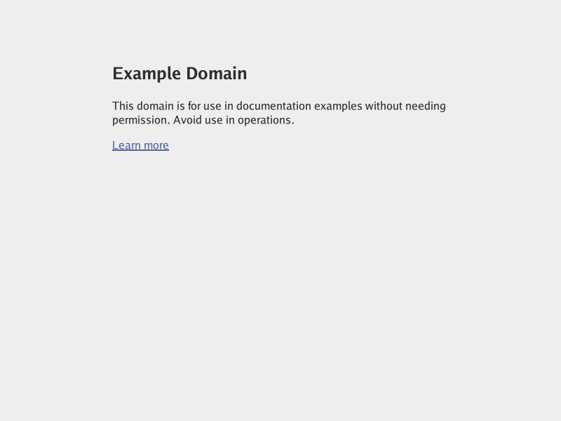
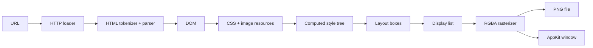

# Gossamer

**A browser engine taking shape in Go, from URL to pixels.**

Gossamer is an experimental browser engine built from scratch in Go. It can
fetch a page, tokenize and parse its HTML, build a DOM, load stylesheets and
images, execute JavaScript in stock V8, compute styles, lay out the document,
produce a display list, and paint the result to a PNG or an interactive native
window.

<p align="center">
  
</p>

<p align="center"><em>example.com rendered by Gossamer at 800 x 600</em></p>

Gossamer is early-stage engine work, not yet a general-purpose browser. The
goal is to grow a correct, understandable pipeline while reusing one
backend-neutral display list for screenshots and interactive presentation.

## Quick start

Gossamer currently targets Go 1.25.3. Remote pages require network access, and
the parent directory for a screenshot must already exist.

```sh
git clone https://github.com/JediWattson/gossamer.git
cd gossamer
```

Fetch a document and print its response body:

```sh
go run ./cmd/gossamer https://example.com
```

Parse the document and inspect the constructed DOM:

```sh
go run ./cmd/gossamer --dump-dom https://example.com
```

Render a fixed 800 x 600 screenshot:

```sh
go run ./cmd/gossamer --screenshot page.png https://example.com
```

The argument order is currently strict. The three modes cannot be combined.
URLs must be absolute `http` or `https` URLs.

You can also build a standalone binary:

```sh
go build -o gossamer ./cmd/gossamer
./gossamer --screenshot page.png https://example.com
```

On Apple Silicon macOS, after building the pinned stock V8 checkout, open the
same browser Page in the native interactive backend:

```sh
tools/v8/bootstrap.sh
tools/v8/build.sh
tools/v8/window.sh https://example.com
```

The native launcher now opens the first functional Graphite browser shell: a
single tab, editable address field, reload command, content viewport, and a
collapsible engine/kernel telemetry rail. Resize, mouse, wheel, keyboard,
focus, and blur input still cross the ordered Page queue. Multiple tabs, a
back-forward cache, scrollbar chrome, clipboard, IME, and accessibility
integration remain future work. See [`docs/graphite-shell.md`](docs/graphite-shell.md)
and [`docs/window-backend.md`](docs/window-backend.md).

## How it works



The display list is deliberately separate from presentation. The PNG command
and native window replay the same paint commands without replacing the
document, style, layout, hit-testing, or input pipeline.

## Phase 0 execution kernel

Gossamer now has an engine-independent execution kernel under
`internal/runtime`. A realm admits one ordered logical executor, drains its
microtasks after each task, and can run concurrently with other realms. Its
first-class queues are also ownership boundaries: fake runtime objects are
published to a queue, transferred to the receiving task, and released in bulk
when that task's logical region ends.

The shadow ledger now backs a small native `RegionStore`. Its typed payloads
live in generation-checked region slots, cross-region writes maintain counted
region edges, and private refs can cross Realm queues only through explicit
Transfer, Publish, or Copy operations. Task and microtask queues use the same
Ref boundary. Explicit promotion copies only a reachable subgraph into
immutable shared storage, allowing the original temporary region to be
released. The first typed ladder now covers Strings, Objects, Arrays, lexical
Contexts, Function descriptors, Promises, BigInts, Symbols, ArrayBuffers,
TypedArrays, Maps, Sets, Dates, RegExps, Errors, weak collections, and opaque
HostObjects. These remain storage and ownership primitives independent from
JavaScript execution semantics and V8 internals. See
[`docs/phase-0-kernel.md`](docs/phase-0-kernel.md) for the invariants and
[`docs/native-heap-types.md`](docs/native-heap-types.md) for the typed payload
contract.

Browser async work now uses that same physical boundary. Timers retain one
Realm-owned HostObject while waiting, transfer it through the task queue when
they fire, and release it with the consumer task. Queued callbacks and
microtasks copy one native callback record directly into their destination
queue; clearing, navigation replacement, and Page teardown destroy records
that never fire.

Cross-Realm transport is now pointer-free as well. Documents have
Browser-unique generations, iframe child Pages own independent Realms, and
parent replacement closes the child graph. Cross-document import/adoption
serializes DOM state through a native ArrayBuffer queue envelope. Native
`postMessage` uses structured clone, including atomic transfer-list validation
and source ArrayBuffer detachment.

A synchronous native interpreter can now execute hand-assembled Function
bytecode over those payloads. Its borrowed frames expose Ref roots, all heap
mutation stays behind TaskContext barriers, and returned private values still
require explicit promotion or queue semantics before task release. Stock V8
remains the browser's JavaScript engine. See
[`docs/native-interpreter.md`](docs/native-interpreter.md) for the instruction
and lifetime contract.

The DOM now also has additive stable `NodeID` identity over its existing
pointer-backed storage. A minimal `Browser`/`Page` boundary ties an indexed
Document to its Realm, URL, resources, invalidation state, and current Frame.
Stable-ID mutations can enqueue a later render task without changing the
working CSS/layout/render implementation.

Navigation now follows that boundary as well: document and subresource I/O
runs off-Realm, browser-owned completion envelopes enter through ordered Page
tasks, stale navigation generations are rejected, and the final resource task
queues rendering. The screenshot CLI uses this same path. See
[`docs/phase-1-navigation.md`](docs/phase-1-navigation.md) for the sequence.

The pre-V8 browser socket is also complete: Page tasks own input hit testing,
timers, classic and module-script evaluation, document lifecycle scheduling,
explicit engine microtask checkpoints,
opaque callback scheduling, and render invalidation. A replaceable fake engine
proves the full click-to-paint flow without a JavaScript parser. See
[`docs/pre-v8-engine-boundary.md`](docs/pre-v8-engine-boundary.md).

An optional stock V8 15.2 adapter now occupies that socket on Apple Silicon.
The pinned, symbolized build keeps JavaScript values under V8 GC while browser
objects remain under Go regions and queue ARC. Its wrapper layer exposes stable
numeric node identity, canonical `Document`/`Node`/`Element`/`HTMLElement`/`Text`
prototypes, namespace-aware creation, selector traversal, inline style, DOM
`Event` objects, capture/target/bubble dispatch, generic listeners, tree and
fragment mutation, markup parsing/serialization, attributes, live child
collections, `classList`, `dataset`, form state, focus, microtasks, and timers
without passing Go pointers into V8. It also exposes live, read-only
`getComputedStyle()` declarations for the longhands represented by the current
style engine; every read crosses the browser host boundary to the current Go
computed-style snapshot rather than caching values in V8.
The first CSSOM View slice adds fresh `DOMRect` values, live element and
viewport dimensions, root scrolling, `scrollIntoView()`, translated paint and
hit testing, and coalesced asynchronous scroll events while reusing the same
immutable Go layout snapshot.
Element overflow scrolling extends that projection with typed `overflow`,
stable-ID element offsets, nested scrollport clipping, ancestor-aware
`scrollIntoView()`, and per-target asynchronous scroll delivery without
rebuilding layout.
Page-relative `performance.now()`, coalesced `requestAnimationFrame` callbacks,
cancellation, and queued viewport resize delivery now form the first browser
frame clock; callback mutations and microtasks publish at most one later frame.
`ResizeObserver` and viewport-root `IntersectionObserver` sample that same
native layout at an explicit checkpoint, retain canonical wrappers while
registered, and release their native claims on disconnect or Realm teardown.
Block positioned layout now supports relative, absolute, and fixed boxes,
physical insets, integer `z-index`, and one shared local order for display-list
paint and hit testing; fixed geometry remains stable through root scrolling.
Single-line `display:flex` containers now support row and column directions,
reversal, ordering, gaps, grow/shrink/basis, justification, and cross-axis
alignment through the same retained geometry and input path.
The first interactive backend now rasterizes each newly published Page frame
into a native-owned AppKit front buffer. Cocoa events are normalized into
value-only records and published through the same ordered Page queue used by
tests and stock V8; native code never receives a DOM node, V8 handle, or Go
pointer.
The Graphite shell is composited in Go around that frame. Its chrome consumes
or translates native events before document hit testing, and its telemetry rail
reads the same Realm profile used by the ownership gates. Stock V8 remains the
active compatibility/reference engine in this checkout; the socket is kept
engine-neutral for Strand to replace it without moving DOM or GUI ownership out
of Go.
Browser input currently covers click, pointer, keyboard, input, focus, and
change event families. Profiling covers heap totals, sampled allocations,
GC callbacks, weak-wrapper collection, wrapper-root region sweeps, callback
publication, explicit Promise checkpoints, and isolate teardown. Task-created
DOM nodes now begin in short-lived construction regions; after task close they
survive only through the connected document graph or live V8 wrappers. A
framework-shaped churn test proves that synchronous node aliases do not create
queue ARC claims. A pinned real React 19.2.7 gate additionally proves initial
render, delegated click and controlled-input updates, unmount, forced GC, and
Realm teardown against the stock engine. See
[`docs/stock-v8-integration.md`](docs/stock-v8-integration.md). The expanded
DOM milestones, including Range, Selection, and mutation-aware traversal, and
their precise compatibility limits are tracked in
[`docs/dom-compatibility.md`](docs/dom-compatibility.md). The milestone 26
release gate adds focused Web Platform behavior, cross-Realm transfer, repeated
form submissions, 200 document replacements, explicit leak assertions, and
performance budgets; see
[`docs/conformance-gate.md`](docs/conformance-gate.md).

## What works today

### Loading and resources

- HTTP and HTTPS document loading, redirects, cancellation, and a 30-second
  client timeout
- Resolution against the final document URL and the first `<base href>`
- Eligible external stylesheet and `` discovery in DOM order
- Navigation-scoped resource caching and independent subresource failures
- Live `document.readyState`, blocking/defer/async initial script scheduling,
  `DOMContentLoaded`/`load`, and browser-resolved HTTP(S) ES-module graphs
- PNG, JPEG, GIF, and WebP decoding with per-image and per-page pixel budgets
- Atomic screenshot replacement, preserving an existing output file's mode

### HTML and DOM

- Tags, attributes, text, comments, doctypes, and character references
- Raw-text and escapable-raw-text elements such as `style`, `title`, and
  `textarea`
- Common implied elements and implied end tags
- Deterministic DOM dumps for parser development
- Stable `NodeID` lookup in both directions through an indexed `Document`
- Optional stock-V8 classic and ES-module execution plus first-slice DOM wrappers on
  Apple Silicon, including delegated DOM event dispatch, live `NodeList` and
  `HTMLCollection` views, `classList`, and `dataset`; default builds still
  render body `<noscript>` fallback

### CSS, layout, and paint

- Type, ID, class, attribute, and combinator selectors with structural,
  linguistic `:lang()`/`:dir()`, logical and relational `:has()`,
  privacy-partitioned link/visited, target,
  hover, active, focus, focus-visible, focus-within, checked, enabled/disabled,
  required/optional, read-only/read-write, placeholder-shown, default,
  indeterminate, valid/invalid, user-valid/user-invalid, and
  in-range/out-of-range pseudo-classes driven by live DOM/browser state
- Cascade ordering across `!important`, specificity, source order, inline
  styles, and named top-level `@layer` rules
- Versioned, immutable computed-style snapshots and a live, read-only
  `getComputedStyle()` subset for the currently supported longhands and custom
  properties, including inherited `direction` kept outside the `all` shorthand
  and inherited `writing-mode` values which participate in `all`
- Inherited custom properties and nested `var()` fallbacks with cycle
  invalidation
- Screen media queries for viewport width, height, orientation, media types,
  comma alternatives, `not`, and `only`
- SVG/CSS named colors, hex, `rgb()`/`rgba()`, `hsl()`/`hsla()`, `hwb()`, and
  `currentcolor` across text, backgrounds, and borders; absolute, percentage,
  em/rem, and modern viewport length units; and bounded typed length math
- Block flow, inline text wrapping, inline and block images, and signed vertical
  margin collapsing across siblings, eligible parent edges, and collapse-through
  empty blocks without crossing flex, overflow, border, or padding barriers
- Content- and border-box sizing, width/height and min/max constraints,
  definite containing-block percentage heights across block, atomic-inline,
  flex, replaced, and positioned boxes, margins, padding, the full CSS
  `none`/`hidden`/`dotted`/`dashed`/`solid`/`double`/`groove`/`ridge`/`inset`/
  `outset` border-style set,
  backgrounds, opacity, start/end/center alignment, and inter-word
  justification of soft-wrapped non-final lines
- Baseline, subscript/superscript, text-edge, middle, line-edge, and typed
  length-percentage `vertical-align` placement for inline runs, replaced
  content, and atomic inline formatting roots, with shifted geometry and hit
  testing
- Block and inline Grid containers with bounded explicit and implicit tracks,
  fixed/percentage/`auto`/`fr`/`min-content`/`max-content` breadths, bounded
  `minmax()` ranges, clamped `fit-content()`, multi-size implicit-track
  patterns, integer and space-sensitive `auto-fill`/`auto-fit` `repeat()`,
  post-placement empty-track/gutter collapse, bounded case-sensitive named
  line sets whose repeated boundaries merge, and rectangular
  `grid-template-areas` that
  generate implicit named boundaries and explicit auto-sized tracks;
  numbered/named positive and negative line placement, `grid-area`, filtered
  named spans, row/column dense auto-flow, gaps, content distribution,
  container/item/self alignment with explicit `safe`/`unsafe` overflow
  positions and first/last baseline groups, anonymous text items, order-modified
  placement and paint, retained track geometry, and live resolved
  `grid-template-*` CSSOM reads; per-axis Subgrid adopts parent tracks, line
  names, gutters, intrinsic descendant contributions, edge decorations, and
  shared row-baseline groups through bounded nesting; vertical Grid roots use
  logical column/row axes for placement, direction, physical edges, hit
  testing, and live geometry, while orthogonal Subgrids exchange parent
  row/column axes with writing-mode-relative track and line-name order; nested
  Grid roots preserve independent horizontal/vertical axes and opposite
  vertical block progression, including horizontal Grid content inside a
  vertical table
- HTML and CSS table display roles with anonymous wrapper fixup, bounded
  intrinsic column sizing, captions, column and row groups, `colspan`/
  `rowspan`, inline-table participation, separated border spacing, fixed
  layout, top/bottom captions, empty-cell decoration control, cell vertical
  alignment, percentage-aware auto/fixed width distribution, caption/grid
  minimum enforcement, automatic anonymous-track merging, renderer-private
  missing-cell fixup, row/row-group and column/column-group `visibility:
  collapse`, spanning-cell clipping, base/reference row-height distribution,
  percentage row/cell constraints, and the compatible second cell-content
  layout pass for percentage-height descendants; distinct anonymous principal
  wrappers retain caption margin boxes and caption-inclusive offset/client/
  scroll dimensions while root and caption border boxes remain separately
  observable through CSSOM; bounded collapsed-border conflict resolution,
  layered backgrounds, retained geometry, live CSSOM reads, mirrored RTL
  columns, row-start/column-start exact-tie ordering, and explicit bounded
  junction geometry which preserves patterned gaps and transparent winners;
  vertical table roots use logical axes for row/column placement, captions,
  spacing, physical box edges, collapsed borders, hit testing, and live CSSOM
  geometry, with bounded sideways Latin paint and upright replaced content
- Inherited `visibility` plus normal, nowrap, pre, pre-wrap, pre-line, and
  break-spaces text whitespace behavior
- Bundled Go sans and monospace families with regular, bold, italic, and
  bold-italic faces; inherited font-family fallback lists, sizing, style,
  weight, line height, underline, and the represented portions of the `font`
  shorthand (`oblique` currently falls back to the italic face)
- Disc, circle, square, and decimal list markers
- A retained layout tree and backend-neutral display list

## Repository layout

| Path | Responsibility |
| --- | --- |
| `cmd/gossamer` | CLI orchestration and screenshot output |
| `internal/loader` | Document and subresource HTTP loading |
| `internal/html` | HTML tokenization and tree construction |
| `internal/dom` | DOM nodes, tree ownership, and deterministic dumps |
| `internal/css` | Stylesheet parsing, selectors, imports, supports, layers, and media queries |
| `internal/resource` | Resource discovery, caching, limits, and image decoding |
| `internal/style` | Cascade, inheritance, typed computed values, and immutable style snapshots |
| `internal/render` | Used-value resolution, layout, display lists, and PNG painting |
| `internal/runtime` | Realms, task and microtask queues, actor scheduling, and shadow ownership telemetry |
| `internal/browser` | Browser/Page ownership, loading, stable-ID mutation scheduling, and frame invalidation |
| `internal/window` | Graphite browser shell, backend-neutral interactive loop, copied frame presentation, and normalized native input |
| `cmd/gossamer-window` | Stock-V8 reference launcher for the Graphite AppKit shell |

## Current limitations

The following are intentionally still outside the current milestone:

- General Web APIs beyond the current V8 DOM slice, script-visible history
  navigation globals, multiple tabs, scrollbar UI, clipboard/IME input, and
  non-macOS interactive backends
- Full HTML error recovery beyond the current table insertion modes and foster
  parenting, including formatting-element reconstruction, complete template
  modes, SVG/MathML, and encoding sniffing
- Flex wrapping and full intrinsic sizing, remaining advanced Grid
  intrinsic/overflow interactions and non-Grid independent descendant
  writing-mode boundaries, remaining advanced table intrinsic sizing,
  non-Grid orthogonal descendants inside vertical tables, and full
  vertical-script text orientation,
  floats, sticky and full inline positioned layout, and retained inline boxes
- The remaining CSS math grammar beyond the current bounded length
  `calc()`/`min()`/`max()`/`clamp()` slice, plus gradients, background images,
  border radii, shadows, transforms, counters, quotation marks, and generated
  images
- Escaped literal dots in layer-name segments, `@font-face`, keyframes,
  arbitrary or repeated non-leading `&` nesting selectors, and the remaining
  media-query and `@supports` syntax beyond the current
  declaration/logical/`selector()` subset
- SVG, AVIF, video, canvas, browser controls, and accessibility trees

Outer and inner display roles are retained for `inline`, `block`, `list-item`,
`inline-block`, `flex`, `inline-flex`, `grid`, and `inline-grid`. Inline-block,
inline-flex, and inline-grid boxes
participate atomically in line layout with shrink-to-fit sizing, baseline
alignment, box-model paint, geometry, and hit testing. Ordinary inline elements
still flatten into runs rather than retained inline boxes. Preserved whitespace
uses the current simple glyph metrics and an eight-space tab approximation;
full nested aligned-subtree bounds, Unicode line breaking, bidi, shaping, and
CSS Text 4 controls remain future work. Screenshots clip to one 800 x 600
viewport. Unsupported CSS is skipped, and failed stylesheets or images degrade
independently so the rest of a page can still render.

The first `getComputedStyle()` surface reports typed computed values and uses a
separate synchronous layout snapshot for width and height when a principal box
has a used value. Percentage-dependent heights serialize to pixels only when
layout proves that their containing-block height is definite; the same values
under an auto-height ancestor retain their computed percentage serialization.
Other box-dependent values, ordinary inline elements, and `display:none`
retain their layout-independent serialization.
`::before` and `::after` have independent live computed-style slots and can
generate inline or block content from bounded string and `attr()` values.
Their layout commands and hit-test ownership remain attached to the originating
element. Other pseudo-elements return an empty live declaration; counters,
quotation marks, generated images, and retained empty inline boxes remain
future work.

## Development

Run the complete test suite:

```sh
go test ./...
```

Run the race detector and static checks:

```sh
go test -race ./...
go vet ./...
```

Fuzz the CSS parser:

```sh
go test ./internal/css -run '^$' -fuzz=FuzzParseDoesNotPanic
```

## Roadmap

The next broad milestones are richer CSS values and formatting contexts, deeper
HTML tree-builder coverage, a real tab model and back-forward cache, and
expanding the first interactive backend beyond its macOS
mouse/keyboard/scroll slice. The existing renderer is structured so each
capability can extend the pipeline instead of replacing it.

The staged CSS architecture and its V8/DOM invalidation boundary are tracked in
[`docs/css-engine-roadmap.md`](docs/css-engine-roadmap.md).
